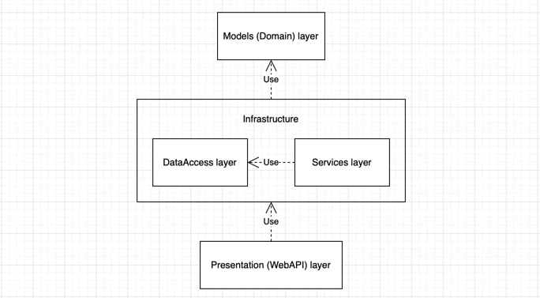

# tele2-test-task

## Description

> ### This code implements multi-layer architecture:
- [x] **Models (Domain)** layer - _just to reduce relationships between layers_
- [x] **Data access** layer
- [x] **Services** layer
- [x] **Presentation (WebApi)** layer

> #### I also implemented some features:
- [x] [_`Github workflow`_](https://github.com/lipa44/tele2-test-task/blob/master/.github/workflows/dotnet.yml) to check if tests are passed when push into master branch
- [x] _`Application`_ is hosted on [_`Azure server`_](https://azure.microsoft.com/en-gb/)
- [x] _`Database`_ is also stored on [_`server`_](https://www.freesqldatabase.com)
- [x] Beautiful documentation in README.md :)

> ### You can try out my application [here](https://tele2-test-task.azurewebsites.net/index.html)

## Models
#### We have a class _`Citizen`_, which has some attributes like _Name_, _Surname_, _Age_, and others.
  - Very simple model without it's own business logic

## Data Access
#### We have a database where Citizens table is stored.
  - C# Citizen class get serialized && deserialized by **`ORM`** which is **`EF Core 6`**
  - Contains _`ApplicationDbContext`_ to work with db tables
  - Contains _`Seed`_ extension method, which fills db with some default data while creating
  - Db is provided by **`MySQL`** (configured into Presentation's layer Startup.cs)
  - Don't have any models configuration because such a primitive model as _`Citizen`_ configured by **`ORM`** by itself

## Services
#### We have a service called _`CitizenService`_ to handle some business logic linked with _`Citizen`_ model.
  - Works with _`ApplicationDbContext`_ to handle **`CRUD`** operations (actually only **`R`** - _read one_)
  - Not really much business logic too in this case, but still

## Presentation
#### We have an _`API`_ to give access to our system all over the world.
  - **`Web API`** is provided by **`ASP.NET Core 6`**
  - _`WebUI`_ && _`Contract`_ are provided by **`Swagger`**
  - When someone sends a request to API, _`CitizensController`_ handles the request and calls _`CitizenService`_ to invoke some business logic
  - When _`CitizenService's`_ method is invoked, we return generic _`ActionResult`_ with _`CitizenDto's`_ or _`CitizenFullDto`_ from the controller, depending on the context
  - Contains custom `RequestValidationMiddleware` to handle exceptions while requests handling
